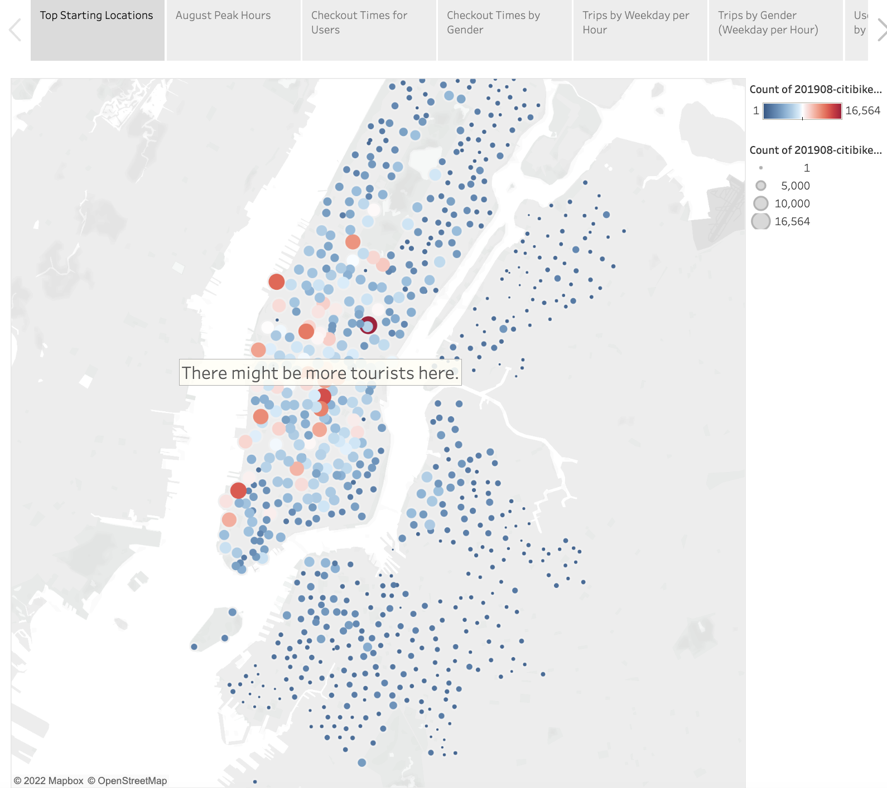
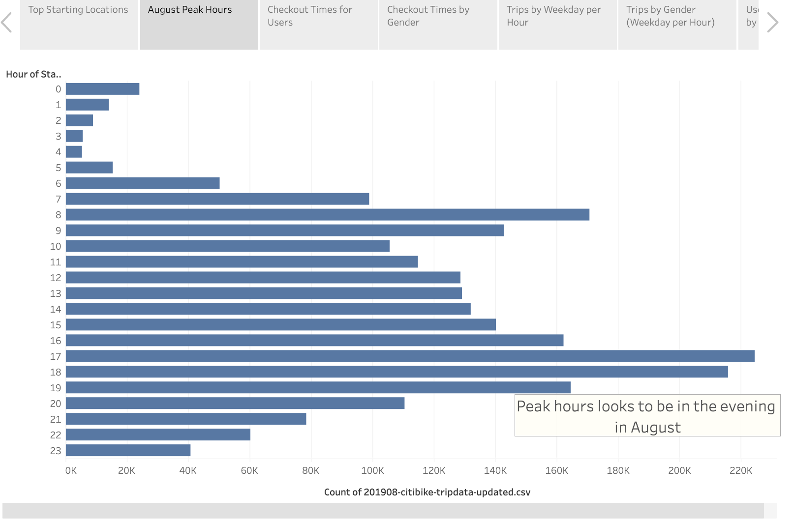
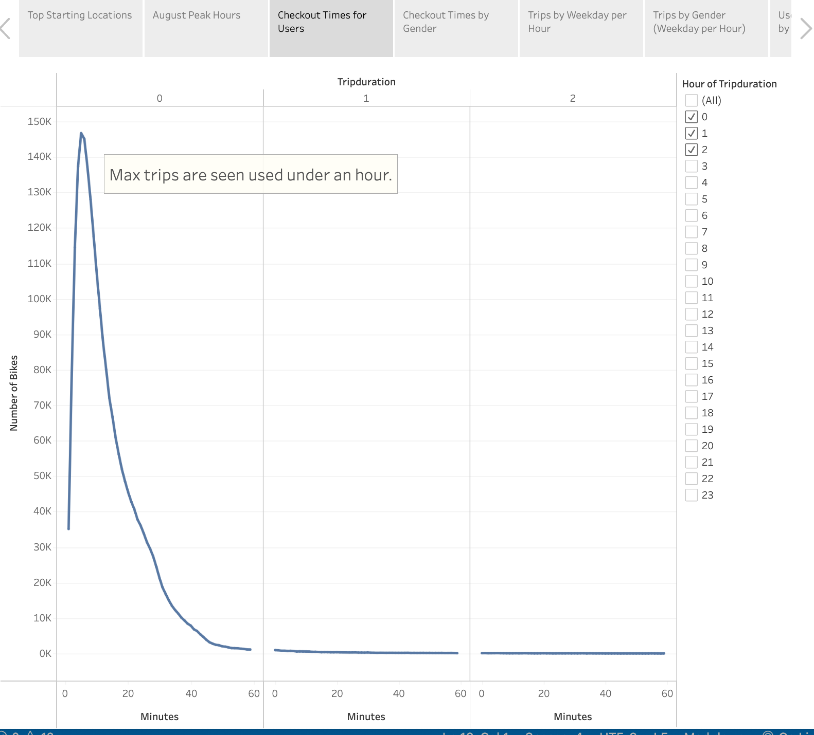
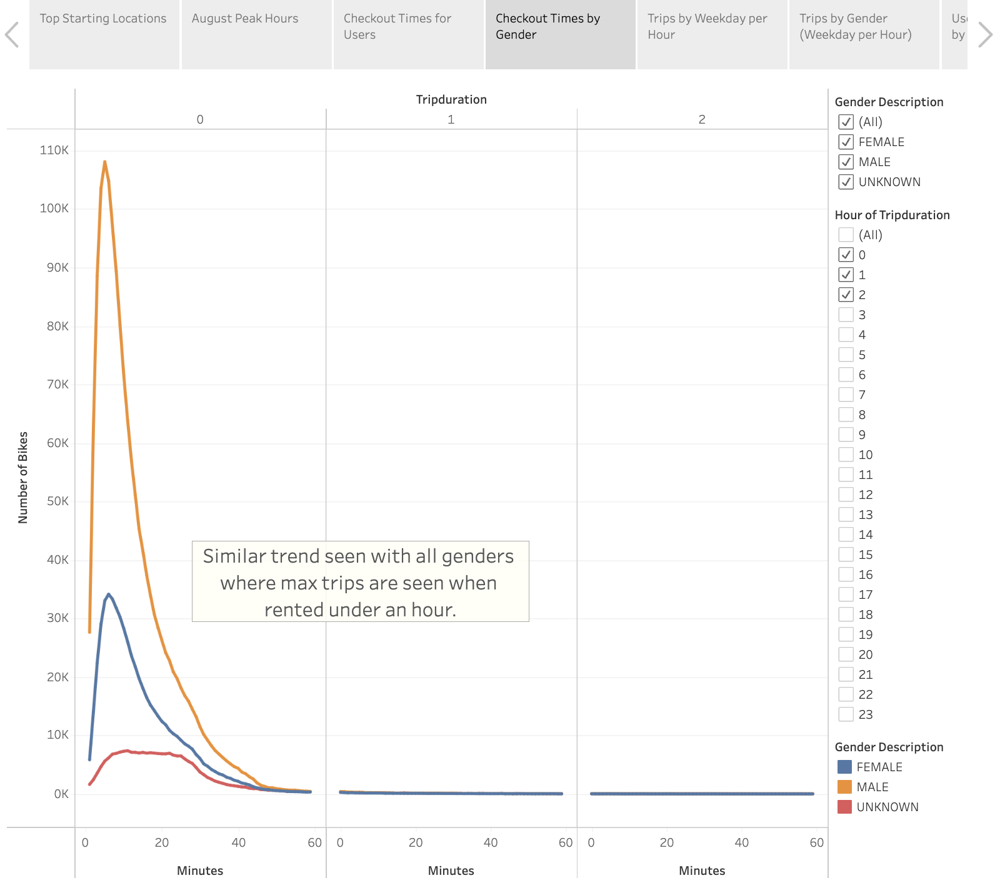
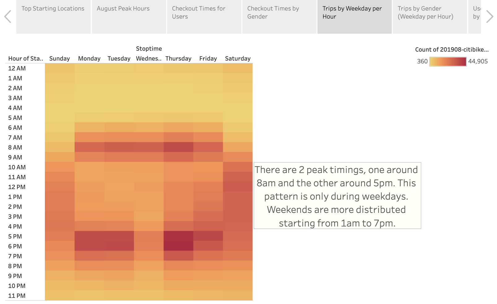
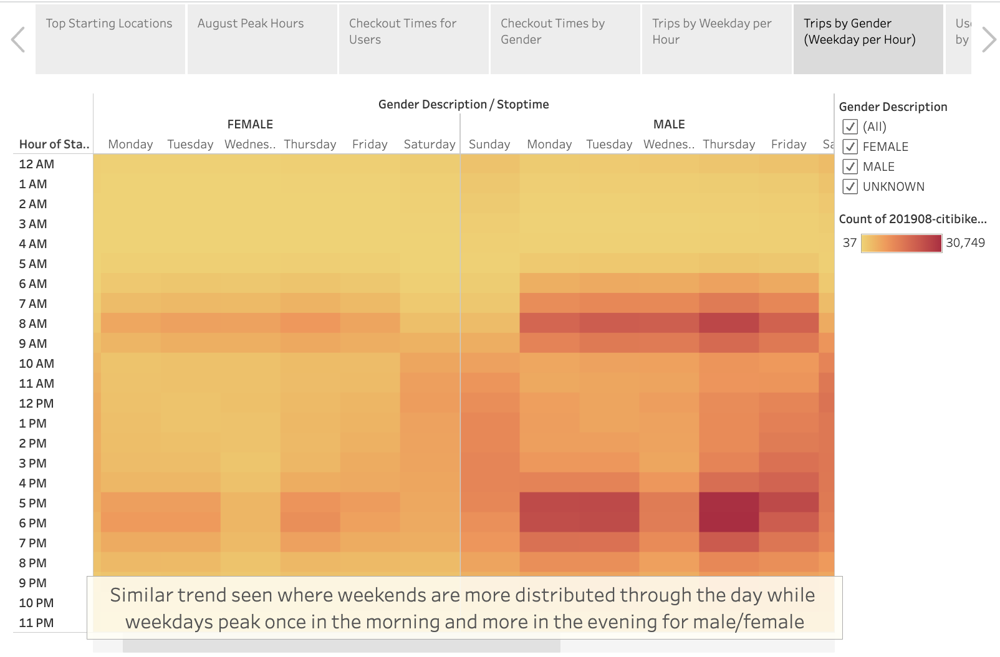
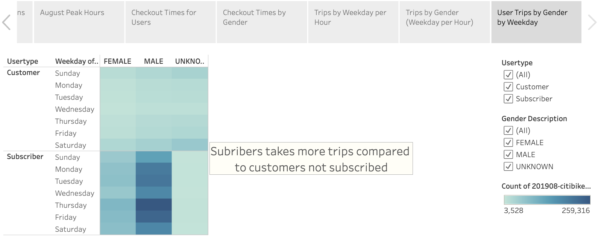

# Bike Sharing Venture

## Overview of the Project

The purpose of this research is show the impact of starting a new bike share business is Des Moines. Though the mechanics between New York and Des Mones are different, this analysis help to analyze how the bike share business works in New York City. 

Along with top locations and peak hours, here using the start time, further analysis is done on checkout time, trips and user trips grouped by gender.

## Resources
- Data Source: 201908-citibike-tripdata-updated.csv
- Software: Python 3.9.7, Jupyter Notebook, tableau
---

## Results

Link to all the analysis is here:
[link to dashboard](https://public.tableau.com/app/profile/sanil.veeravu/viz/NYCBikeChallengeFinal/NYCBikeAnalysis#1)

Below are the key findings based on the research from New York City Bike Sharing data.

1. Looking at the overall distribution of trips by each location we can see the area in new york city that higher volume indicating more spots with more tourists.

    

2. Looking at when most bike are in demand based on August data it shows there is little spike in the morking around 7am but finally the peak hours are in the evening 5pm and later.

    

3. Looking at how much time are the bikes checked out for, based on the data clearly shows the max peak is for a shorter period of less than hour.

    

4. Grouping the same above by gender a very similar pattern is observed. One indicator is that the volume of female riders is comparitively less.

    

5. Looking at the trips by week the interesting observation is that the peak hours as noticed in point 2 is at 7am and more at 8pm but only during weekdays. During weekends the trips are distributed through the day from morning to evening. 

    

6. Grouping the same data above with Gender the pattern looked similar for the peaks but as observed the number of female riders were less 

    

7. This final chart shows an interesting observation of subscribers vs customers and clearly shows subscribers tend to use the bikes more often. Adding to that for non subscribers there is a higher usage during weekends.

    

---

## Summary

The above data clearly shows great opportunities based on New Yor City data. Important options to be added to attract more bikers would be to bring a subscription option. Focus is needed in core areas with increase number of bikes. With the peak times need to plan how to place the bikes accordingly during the time.

Few additional metrics that could be looked at:
1. Bike usage based on age will give a good understanding on what demographic based on age are interested in this.
2. Understanding on bike usage overtime will give a good estimate on repairs that would be need as a maintenance cost for this initiative.

